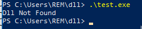
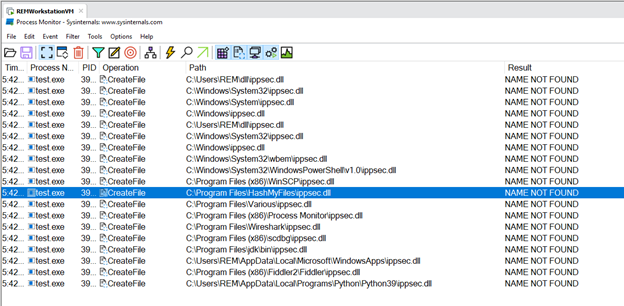
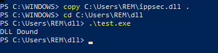
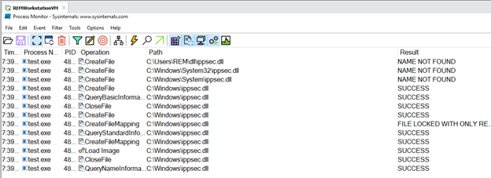
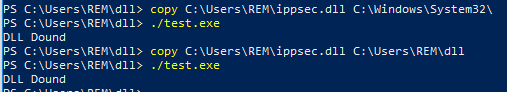
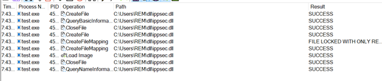

# DLL-Search-order-Hijacking

Place a malicious DLL file ahead of original DLL in search order 
Dll search order  
•	Application Installed Directory  
•	System Directory (C:\Windows\System32)  
•	16-bit System Directory (C:\Windows\System)  
•	Windows Directory (C:\Windows)  
•	Directories listed in %PATH% (Environment Variables)  

Based on the above DLL search order, for example test.exe needs to load ippsec.dll from Windows Directory (C:\Windows) but attacker place malicious ippsec.dll before Windows Directory (C:\Windows) i.e., at 16-bit System Directory (C:\Windows\System) so in this example test.exe loads malicious ippsec.dll from 16-bit System Directory (C:\Windows\System) as per Dll search order this is called DLL Search order Hijacking.. 

Different testoutputs:  

  
  
  
  
  
  
